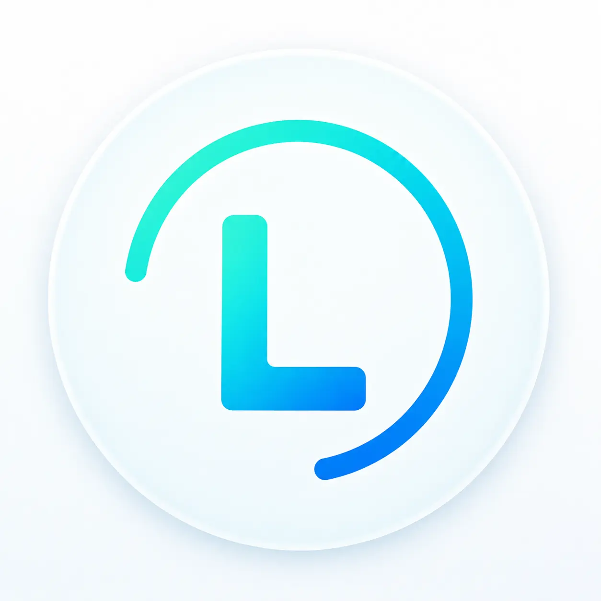

<p align="center">
  
</p>

# CreceWeb Lumen

**A lightweight WordPress ecosystem for freelancers, agencies and site builders who want a fast, flexible and consistent way to build professional websites.**

CreceWeb Lumen is built around a simple idea:

> **Start lightweight. Add functionality intentionally.**

Instead of turning the theme into a large multipurpose framework, Lumen separates the website foundation, practical tools and advanced functionality into clear layers.

---

## The Lumen ecosystem

### Lumen Theme

The lightweight foundation of the ecosystem.

It provides the core WordPress presentation layer, including:

- responsive layouts;
- header and navigation;
- Gutenberg integration;
- blog and content presentation;
- full-width templates;
- accessibility-focused navigation;
- branding and appearance controls;
- compatibility with common WordPress workflows.

**Available on WordPress.org**

[View Lumen Theme](https://wordpress.org/themes/creceweb-lumen/)

---

### Lumen Lite

The free companion plugin for Lumen Theme.

It adds practical tools for building and managing WordPress websites, including:

- Lumen Library;
- reusable Gutenberg sections and pages;
- reading progress;
- automatic table of contents;
- sharing tools;
- related content;
- floating actions;
- messaging integrations;
- menu enhancements;
- responsive visibility controls;
- footer tools.

Lumen Lite is designed to remain useful as a free plugin and does not require Lumen Pro.

**Available on WordPress.org**

[View Lumen Lite](https://wordpress.org/plugins/creceweb-lumen-lite/)

---

### Lumen Pro

Lumen Pro is the optional commercial extension of the ecosystem.

It adds advanced tools, integrations and workflow features for users who need more than the free Theme + Lite combination.

Lumen Pro is distributed directly by CreceWeb and is not published on WordPress.org.

[Learn more about Lumen](https://creceweb.com.ar/lumen)

---

## Why Lumen?

Many WordPress themes gradually become large frameworks containing features that every website must load or manage, even when those features are not needed.

Lumen takes a different approach.

### Lightweight foundation

The Theme focuses on the core website experience instead of trying to include every possible feature.

### Modular architecture

Theme, Lite and Pro have clearly separated responsibilities.

### Performance focused

Performance is treated as an architectural requirement rather than something added only after development.

### WordPress native

Lumen works with WordPress and Gutenberg instead of replacing the native editing experience with a proprietary builder.

### Practical tools

Features are selected around real website-building workflows rather than feature-count marketing.

---

## Who is Lumen for?

Lumen is designed for:

- WordPress freelancers;
- web agencies;
- independent developers;
- Gutenberg users;
- professional site builders;
- performance-conscious WordPress users;
- teams that want a reusable foundation across multiple websites.

---

## Architecture

```text
CreceWeb Lumen
│
├── Lumen Theme
│   └── Core website foundation
│
├── Lumen Lite
│   └── Free practical tools
│
└── Lumen Pro
    └── Optional advanced functionality
```

The goal is to keep each layer understandable and maintainable.

---

## Open source

Lumen Theme and Lumen Lite are publicly available through the official WordPress ecosystem.

Both are developed using WordPress coding standards and distributed under GPL-compatible licensing.

The public source repositories for Theme and Lite are maintained separately so each project can have its own:

- release history;
- issues;
- changelog;
- source code;
- contribution workflow.

---

## Official links

### Website

[creceweb.com.ar/lumen](https://creceweb.com.ar/lumen)

### WordPress.org Theme

[CreceWeb Lumen](https://wordpress.org/themes/creceweb-lumen/)

### WordPress.org Plugin

[CreceWeb Lumen Lite](https://wordpress.org/plugins/creceweb-lumen-lite/)

### Source repositories

[Lumen Theme source](https://github.com/creceweb-lumen/lumen-theme)
[Lumen Lite source](https://github.com/creceweb-lumen/lumen-lite)
  
### Developer

[CreceWeb](https://creceweb.com.ar/)

---

## Development

Lumen is actively developed by CreceWeb.

Public releases of Lumen Theme and Lumen Lite are published through WordPress.org.

Stable source repositories are maintained separately from internal development, testing and pre-release builds.

This repository serves as the central overview of the Lumen ecosystem.

---

## Feedback

If you find a bug in Lumen Theme or Lumen Lite, please report it in the corresponding repository:

- [Lumen Theme issues](https://github.com/creceweb-lumen/lumen-theme/issues)
- [Lumen Lite issues](https://github.com/creceweb-lumen/lumen-lite/issues)

General information, documentation and product details are available on the official Lumen website.

---

## Support Lumen

If Lumen helps you build better WordPress websites, you can support its continued development.

[Support Lumen](https://creceweb.com.ar/lumen/apoyar-theme-lite)

---

## License

Lumen Theme and Lumen Lite are distributed under GPL-compatible open-source licensing.

Lumen Pro is distributed separately under its own commercial terms.

See the individual product repositories and distribution packages for the applicable license details.

---

## About CreceWeb

CreceWeb develops websites and WordPress tools with a focus on performance, maintainability and practical implementation.

Lumen grew from that experience as a reusable foundation for real-world WordPress projects.

---

**CreceWeb Lumen**  
Lightweight by design. Practical by default.
